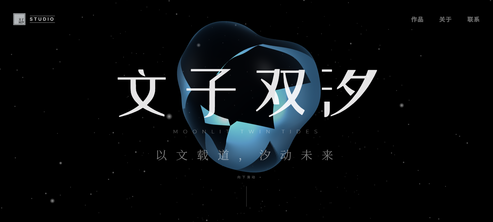

<div align="center">
  
</div>

# Creator-AI-Homes

**Creator-AI-Homes** 是一个早期阶段的开源个人 AI / 自媒体知识主页项目，面向独立创作者、AI 工具分享者、内容创作者和个人品牌建设者。

这个项目最初是我的个人网站，但我正在把它逐步改造成一个可复用的开源网站模板，帮助更多创作者快速搭建自己的个人主页、AI 内容展示页、项目作品集和部署流程。

> 当前状态：早期阶段，公开维护中，持续完善文档、结构和安全实践。

---

## 项目介绍

Creator-AI-Homes 是一个基于 TypeScript + Vite 构建的网站项目，适合用来搭建简洁、可定制、易部署的个人网站。

它可以作为：

- 个人主页
- AI 工具 / 自媒体内容展示站
- 个人项目作品集
- 独立创作者网站模板
- AI 辅助个人网站的起始项目
- 可 fork、可二次开发的开源模板

项目中包含前端页面结构、服务端 API 代理逻辑、环境变量配置示例以及部署相关结构，适合想要在个人网站中安全集成 AI API 的创作者参考和使用。

---

## 为什么开源？

很多独立创作者都想拥有自己的个人网站、AI 内容主页或作品展示页，但在实际搭建时经常会遇到这些问题：

- 不知道如何组织项目结构
- 不清楚如何配置 API Key
- 不熟悉前后端环境变量管理
- 不知道如何安全地接入 AI API
- 不会部署到 Cloudflare、Vercel 等平台
- 缺少一个简单、清晰、可复用的模板

因此，我希望把这个项目逐步整理成一个对其他创作者有参考价值的开源项目。

后续我会重点完善：

- 项目文档
- 部署教程
- 安全说明
- AI API 接入示例
- 中文使用说明
- 可复用模板结构
- 适合创作者的网站模块

---

## 功能特点

- 基于 TypeScript + Vite 构建
- 适合个人主页和创作者网站
- 支持 AI / 媒体内容展示
- 包含服务端 API 代理示例
- 包含环境变量配置示例
- 支持 Gemini API 接入示例
- 适合部署到 Cloudflare / Vercel 等平台
- 代码结构清晰，便于 fork 和二次开发
- 面向独立创作者的开源网站模板

---

## 技术栈

- TypeScript
- Vite
- Node.js
- Gemini API
- HTML / CSS
- Cloudflare 部署流程
- 前端组件化结构

---

## 项目结构

```txt
wzsx.homes/
├── public/                # 静态资源
├── server/                # 服务端 API 代理逻辑
├── src/                   # 前端源码
├── .env.example           # 环境变量示例
├── AI_PROXY_README.md     # AI 代理相关说明
├── index.html             # 页面入口
├── package.json           # 项目依赖和脚本
├── tsconfig.json          # TypeScript 配置
└── vite.config.ts         # Vite 配置
```

---

## 本地运行

### 环境要求

请先安装 Node.js。

可以通过下面命令检查：

```bash
node -v
npm -v
```

### 安装依赖

```bash
npm install
```

### 配置环境变量

复制 `.env.example`，创建本地环境变量文件：

```bash
cp .env.example .env.local
```

然后在 `.env.local` 中填写你的 API Key：

```env
GEMINI_API_KEY=your_api_key_here
```

### 启动项目

```bash
npm run dev
```

启动后，打开终端中显示的本地地址即可预览项目。

---

## 安全说明

本项目可能涉及第三方 AI API Key 和服务端 API 代理逻辑，因此安全性非常重要。

项目应避免：

- 将 API Key 暴露在前端代码中
- 将 `.env` 或 `.env.local` 文件提交到仓库
- 让未经校验的用户输入直接进入 API 请求
- 配置过于宽松的 CORS 规则
- 将不必要的服务端接口暴露到公网
- 在公开仓库中泄露敏感配置

后续计划完善：

- 添加 `SECURITY.md`
- 增加依赖漏洞检查
- 完善 API 代理输入校验
- 增加环境变量安全说明
- 增加部署安全检查清单
- 使用 Codex 辅助进行安全审查和代码维护

---

## 开发路线图

- [ ] 重写并完善项目文档
- [ ] 添加 MIT License
- [ ] 添加 `SECURITY.md`
- [ ] 添加 `CONTRIBUTING.md`
- [ ] 添加 Issue 模板
- [ ] 添加 Pull Request 模板
- [ ] 添加公开部署教程
- [ ] 添加中文使用说明
- [ ] 添加项目截图和演示说明
- [ ] 添加更新日志 `CHANGELOG.md`
- [ ] 改进 API 代理安全性
- [ ] 优化创作者网站模板结构
- [ ] 增加 Codex 辅助代码审查流程
- [ ] 让更多独立创作者可以 fork 后快速使用

---

## 如何贡献

这个项目目前由我个人维护，但欢迎任何形式的贡献。

你可以通过以下方式参与：

- 改进文档
- 提交 Bug 反馈
- 提出新功能建议
- 优化部署流程
- 改进安全实践
- 添加适合创作者使用的网站模块
- 帮助完善 AI API 接入示例

在提交较大的修改前，建议先创建 Issue 进行讨论。

---

## 维护者

本项目由 [Wh1tZz](https://github.com/Wh1tZz) 维护。

我是一名独立创作者，长期关注 AI 工具、开源项目、个人网站和内容创作工作流。这个仓库是我探索 AI / 自媒体个人网站开源化的一部分，希望它未来可以帮助更多创作者快速搭建属于自己的个人网站。

---

## 许可证

本项目基于 MIT License 开源。

你可以自由使用、修改、分发和二次开发本项目，但需要保留原始版权声明。


---

## 当前状态

这是一个早期阶段的开源项目。

仓库目前已经公开，并由我持续维护。当前重点是完善项目结构、文档、安全实践和部署流程，让它从一个个人网站逐步变成一个其他创作者也可以复用的开源模板。
